

Our goal as Data Analysts is to arrange the insights of our data in such a way that everybody who sees them is able to understand their implications and how to act on them clearly.

Tableau is a data analytics and visualization tool used widely in the industry today. Many businesses even consider it indispensable for data-science-related work. Tableau's ease of use comes from the fact that it has a drag and drop interface. This feature helps to perform tasks like sorting, comparing and analyzing, very easily and fast. Tableau is also compatible with multiple sources, including Excel, SQL Server, and cloud-based data repositories which makes it an excellent choice for Data Scientists.

#### This tutorial will cover the following topics:

*   #### [1\. Introduction to Tableau](#introduction-to-tableau)

    *   Overview
    *   Installation
*   #### [2\. Getting Started](#getting-started)

    *   Tableau Workspace
    *   Connecting to a Data Source
    *   Creating a view
    *   Refining the view
*   #### [3\. Emphasizing the Results](#emphasise-the-results)

    *   Adding Filters to the view
    *   Adding Colors to the view
    *   Key Findings
*   #### [4\. Map View](#map-view)

    *   Building a Map View
    *   Getting into details
    *   Identifying the Key points
*   #### [5\. Dashboard](#dashboard)

    *   Creating a dashboard
    *   Adding Interactiveness
*   #### [6\. Story](#story)

    *   Building a Story
    *   Making a Conclusion
*   #### [7\. Tableau's integration with R, Python & SQL Server](#tableau_with_R,Python,SQL)

    *   Tableau & R
    *   Tableau & Python
    *   Tableau & SQL Server
*   #### [8\. Saving the Work](#saving)

# 1.Introduction to Tableau

## Overview

[Tableau Software](https://www.tableau.com/) is a software company headquartered in Seattle, Washington that produces interactive data visualization products focused on business intelligence. Tableau was established at Stanford University’s Department of Computer Science between 1997 and 2002[(Wikipedia)](https://en.wikipedia.org/wiki/Tableau_Software)

The main products offered by tableau are:

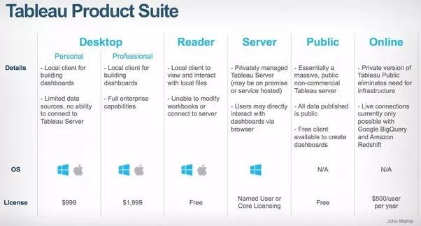

### **Tableau Desktop, Tableau Public, and Tableau Online**, all offer Data Visual Creation and choice depends upon the type of work

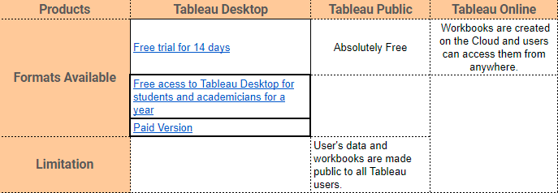

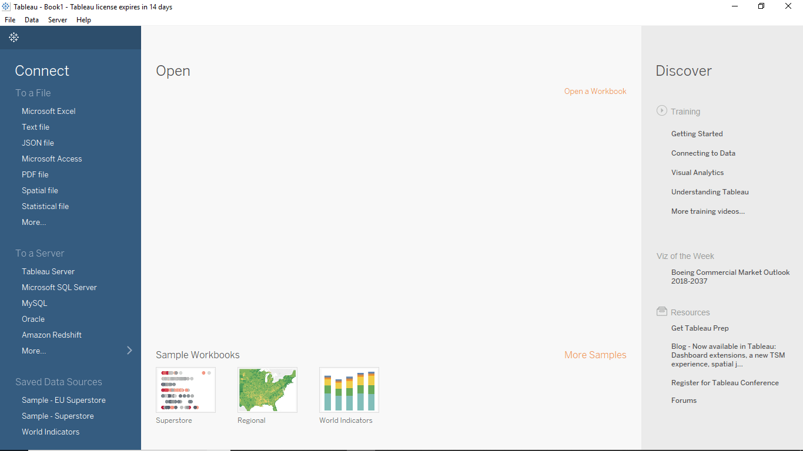

# 2.Getting Started

In this section, we will learn some basic operations in Tableau to get accustomed to its interface.

## Tableau Workspace

The Tableau workspace is a collection of worksheets, menu bar, toolbar, marks card, shelves and a lot of other elements about which we will learn in sections to come. Sheets can be worksheets, dashboards, or stories. The image below highlights the major components of the workspace. However, more familiarity will be achieved once we work with actual data.

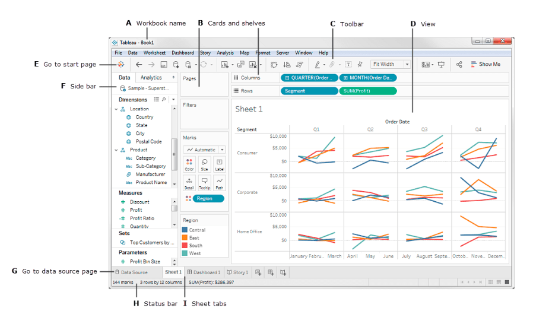 source:Tableau.com

## Connecting to a Data Source

To begin working with Tableau, we need to connect Tableau to the data source. Tableau is compatible with a lot of data sources. The data sources supported by Tableau appear on the left side of the opening screen. Some commonly used data sources are excel, text file, relational database or even on a server. One can also connect to a cloud database source such as Google Analytics, Amazon Redshift, etc.

The launch screen of Tableau Desktop shows the available data sources that one can connect too. It is also dependent on the version of Tableau since the paid version offers more possibilities. On the left side of the screen, there is a `Connect` pane which highlights the available sources. File types are listed first, followed by common server types, or the servers that have been recently connected. You can open previously created workbooks Under `Open` tab. Tableau Desktop also provides some sample workbooks under `Sample Workbooks`.

### `Hands On`

#### Connecting to the [Sample-Superstore data set](https://github.com/parulnith/Data-Visualisation-with-tableau/blob/master/Data%20Visualisation%20with%20Tableau/Sample-Superstore%20.xls)

We shall be working with a sample data set names **Superstore dataset**, that comes pre-loaded with Tableau. However, we will be downloading the file from [here](https://github.com/parulnith/Data-Visualisation-with-tableau/blob/master/Data%20Visualisation%20with%20Tableau/Sample-Superstore%20.xls) so that we can get an idea of connecting to an Excel data source. The data is that of a superstore. It contains information about products, sales, profits, etc. Our aim as Data Analysts is to analyze the data and find critical areas of improvement within this fictitious company.

### `Steps`

1.  Import the Data into tableau workspace from the computer.

2.  Under the Sheets Tab, three sheets will become visible namely Orders, People, and Returns. However, we will focus only on Orders data. Double click on Orders Sheet, and it opens up just like a spreadsheet.

3.  We observe the first three rows of data looks a bit different and is not in the desired format. Here we make use of **Data Interpreter**, also present under Sheets Tab. By clicking on it, we get a nicely formatted sheet.

### `Hands On`

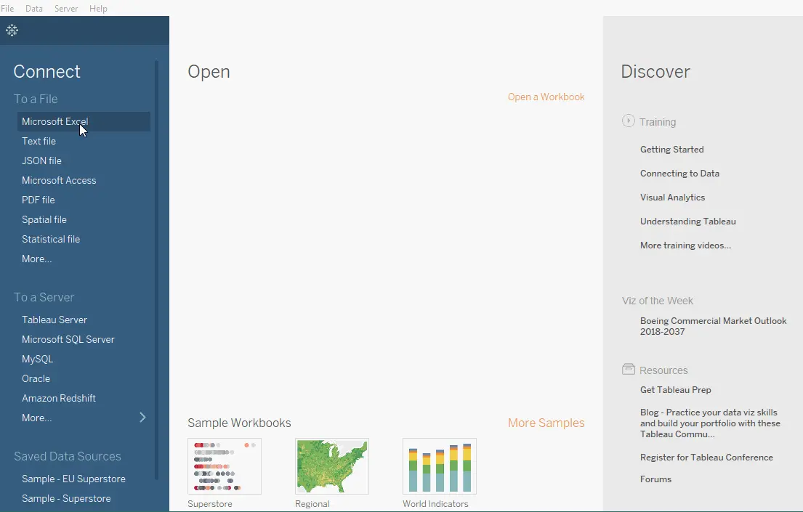

## Creating a View

We will start by generating a simple chart. In this section, we will get to know our data and will begin to ask questions about the data to gain insights. There are some important terms that we will encounter in this section.

`Dimension`

`Measures`

`Aggregation`

[Dimensions](https://onlinehelp.tableau.com/current/guides/get-started-tutorial/en-us/get-started-tutorial-drag.html) are qualitative data, such as a name or date. By default, Tableau automatically classifies data that contains qualitative or categorical information as a dimension, for example, any field with text or date values. These fields generally appear as column headers for rows of data, such as Customer Name or Order Date, and also define the level of granularity that shows in the view.

[Measures](https://onlinehelp.tableau.com/current/guides/get-started-tutorial/en-us/get-started-tutorial-drag.html) are quantitative numerical data. By default, Tableau treats any field containing this kind of data as a measure, for example, sales transactions or profit. Data that is classified as a measure can be aggregated based on a given dimension, for example, total sales (Measure) by region (Dimension).

[Aggregation](https://onlinehelp.tableau.com/current/guides/get-started-tutorial/en-us/get-started-tutorial-drag.html) is the row-level data rolled up to a higher category, such as the sum of sales or total profit.

Tableau automatically sorts the fields in Measures and Dimensions. However, for any anomaly, one can change it manually too.

### `Steps`

1.  Go to the worksheet. Click on the tab `Sheet 1` at the bottom left of the tableau workspace.

    
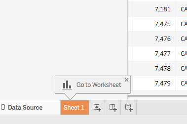

2.  Once, you are in the worksheet, from `Dimensions` under the Data pane, drag the `Order Date` to the Column shelf.

    _On dragging the `Order Date` to the columns shelf, a column for each year of Orders is created in the dataset. An 'Abc' indicator is visible under each column which implies that text or numerical or text data can be dragged here. On the other hand, if we pulled `Sales` here, a cross-tab would be created which would show the total Sales for each year._

3.  Similarly, from the `Measures` tab, drag the `Sales` field onto the Rows shelf.

_Tableau populates a chart with sales aggregated as a sum. Total aggregated sales for each year by order date is displayed. Tableau always populates a line chart for a view that includes time-field which in this example is Order Date_.

### `Hands On`

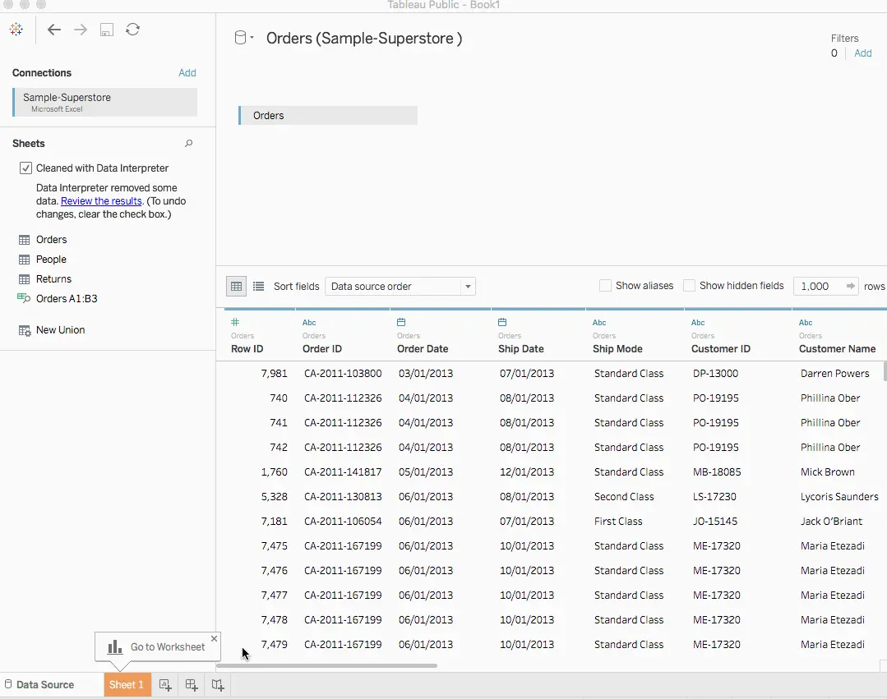

#### _What does the line chart above convey? Well, it shows that the sales look quite promising and appear to be increasing with time. This is a valuable insight, but it hardly says much about the products which are contributing to increased Sales. Let us delve further to get more insights._

## Refining the View

Let us delve deeper and try to find out more insights regarding which products drive more sales. Let's start by adding the product categories to look at sales totals in a different way.

### `Steps`

1.  `Category` is present under the Dimensions pane. Drag it to the columns shelf and place it next to `YEAR(Order Date)`. The `Category` should be placed to the right of `Year`. In doing so, the view immediately changes to a bar chart type from a line. The chart shows the overall `Sales` for every `Product` by year.

    `Learn More`

    To view information about each data point (that is, mark) in the view, hover over one of the bars to reveal a tooltip. The tooltip displays total sales for that category. Here is the tooltip for the Office Supplies category for 2016:

    
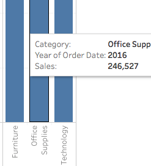

    To add labels to the view, click `Show Mark Labels` on the toolbar.

    
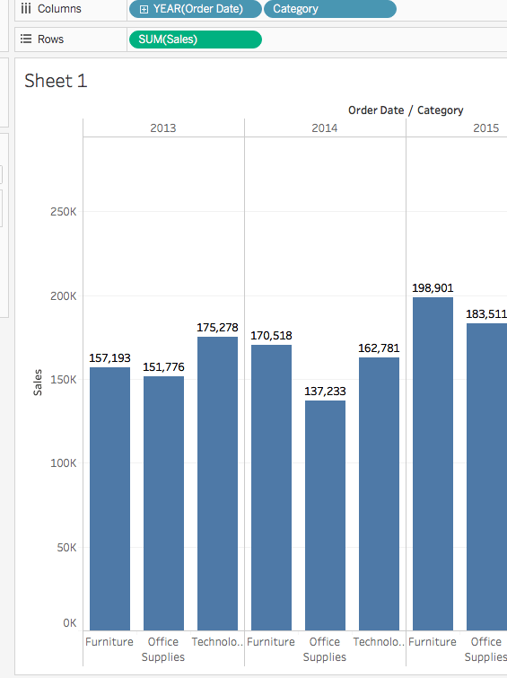

    The bar chart can be displayed horizontally instead of vertically too. Click `Swap` on the toolbar for the same.  

    
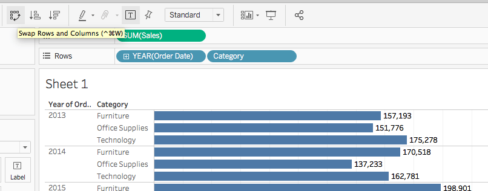

 2\. The view above nicely shows `sales` by `category`, i.e., furniture, office supplies, and technology. We can also infer that furniture sales are growing faster than sales of office supplies except for 2016\. Hence it will be wise to focus sales efforts on furniture instead of office supplies. But furniture is a vast category and consists of many different items. How can we identify which furniture item is contributing towards maximum sales?

To help us answer that question, we decide to look at products by `Sub-category` to see which items are the big sellers. Let's say for the **Furniture** category; we want to look at details about only bookcases, chairs, furnishings, and tables. We will Double-click or drag the `Sub-Category` dimension to the Columns shelf.

The sub-category is another discrete field. It further dissects the `Category` and displays a bar for every `sub-category` broken down by category and year. However, it is a humongous amount of data to make sense of visually. In the next section, we will learn about filters, color and other ways to make the view more comprehensible.

### `Hands On`

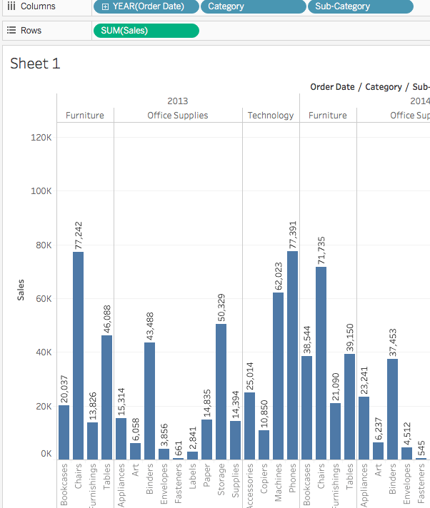

# 3.Emphasizing the Results

In this section, we will try to focus on specific results. Filters and colors are ways to add more focus to the details that interest us.

## Adding filters to the view

Filters can be used to include or exclude values in the view. Here we try to add two simple filters to the worksheet to make it easier to look at product sales by sub-category for a specific year.

### `Steps`

In the Data pane, under Dimensions, right-click Order Date and select Show Filter.Repeat for Sub->category field also.

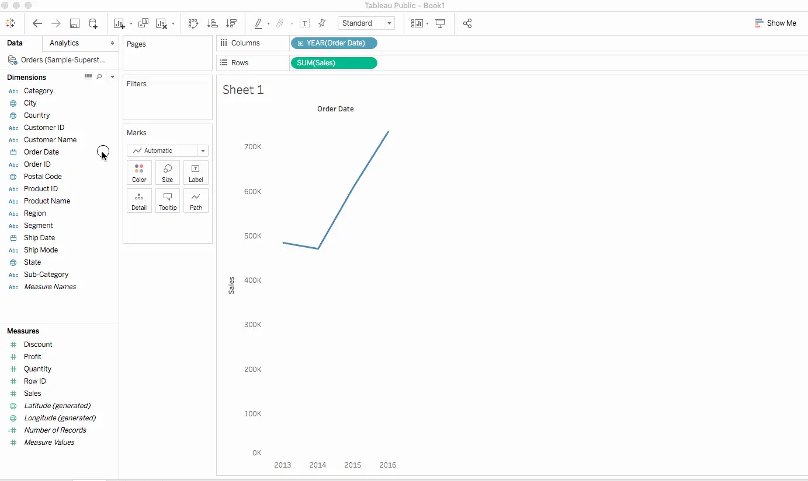

#### **Filters are the type of cards and can be moved around on the worksheet by simple drag and drop**

## Adding colors to the view

**Colors can be helpful in the visual identification of a pattern.**

### `Steps`

In the Data pane, under Measures, drag Profit to Color on the Marks card.

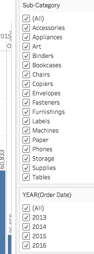

**It can be seen that Bookcases, Tables and even machine contribute to negative profit, i.e., loss. A powerful insight.**

### `Hands On`

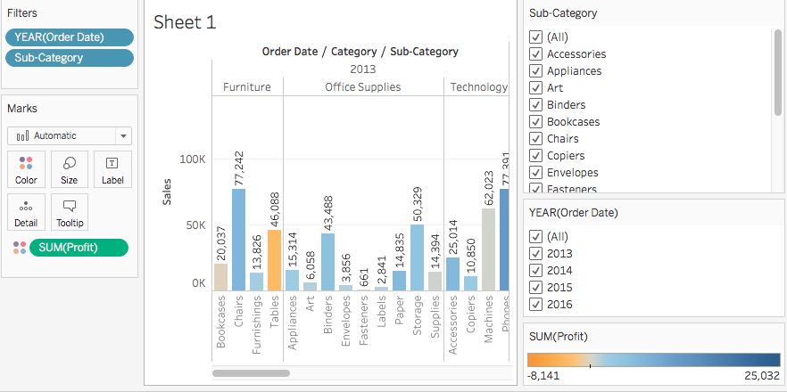

## Key Findings

Let's take a closer look at the filters to find out more about the unprofitable products.

### `Steps`

1.  In the view, in the `Sub-Category` filter card, uncheck all boxes except `Bookcases`, `Tables`, and `Machines`. This brings to light an interesting fact. While in some years, Bookcases and Machines were actually profitable. However, in 2016, Machines became unprofitable.
2.  Select `All` in the `Sub-Category` filter card to show all the subcategories again.
3.  From the Dimensions, drag `Region` to the `Rows` shelf and place it to the left of the Sum(Sales) tab. We notice that machines in the South are reporting a higher negative profit overall than in your other regions.
4.  Let us now give a name to the sheet. At the bottom-left of the workspace, double-click `Sheet 1` and type `Sales by Product and Region`.
5.  In order to preserve the view, Tableau allows us to duplicate our worksheet so that we can continue in another sheet from where we left off.
6.  In your workbook, right-click the `Sales by Product and Region` sheet and select `Duplicate` and rename the duplicated sheet to `Sales-South`.
7.  In the new worksheet, from Dimensions, drag `Region` to the `Filters` shelf to add it as a filter in the view.
8.  In the Filter Region dialogue box, clear all check boxes except South and then click `OK`. Now we can focus on sales and profit in the `South`. We find that machine sales had a negative profit in 2014 and again in 2016\. We will investigate this in the next section
9.  Lastly, do not forget to save the results by selecting `File > Save As`. Let us name our workbook as `Regional Sales and Profits`.

### `Hands On`

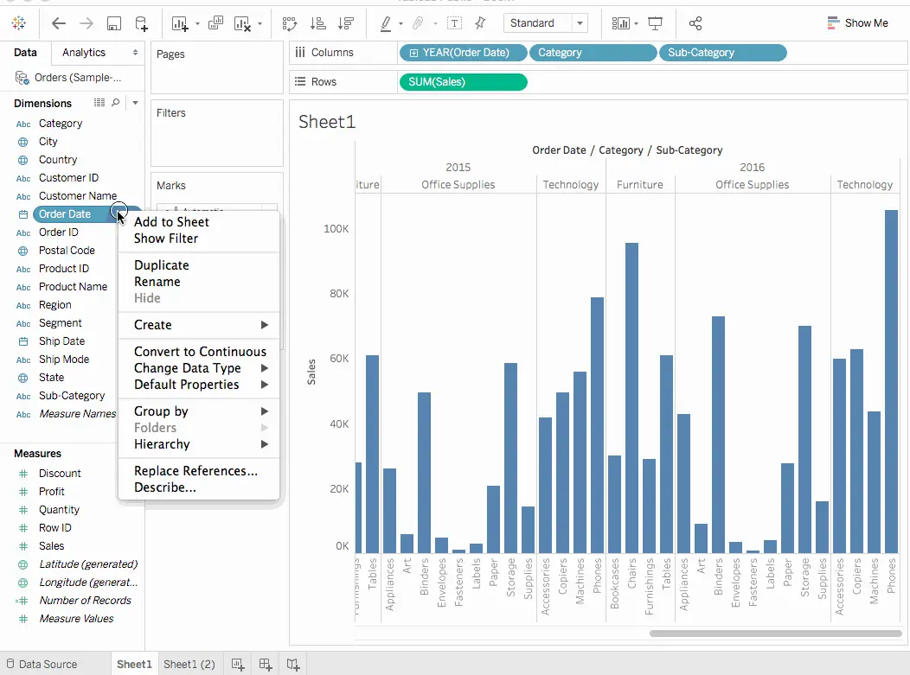

# 4.Map View

## Creating a Map View

#### **Map views are beneficial when we are looking at geographic data (the Region field). In the current example, Tableau automatically recognizes that the Country, State, City, and Postal Code fields contain geographical information.**

### `Steps`

1.  Create a new worksheet.
2.  Add `State` and `Country` under Data pane to `Detail` on the Marks card. We obtain the map view.
3.  Drag `Region` to the `Filters` shelf, and then filter down to `South` only. The map view now zooms in to the South region only, and a mark represents each state.
4.  Drag the `Sales` measure to the `Color` tab on the Marks card. We obtain a filled map with the colors showing the range of sales in each state.
5.  We can change the color scheme by clicking `Color` on the Marks card and selecting `Edit Colors`. We can experiment with the available palettes.
6.  We observe that **Florida** is performing the best regarding Sales. If we Hover over Florida, it shows a total of 89,474 USD in sales, as compared to South Carolina, for example, which has only 8,482 USD in sales. Let us gauge the performance by `Profit` now since Profit is a better indicator than Sales alone.
7.  Drag `Profit` to `Color` on the Marks card. We now see that Tennessee, North Carolina, and Florida have negative profit, even though it appeared they were doing good in Sales. Rename the sheet as Profit Map

### `Hands On`

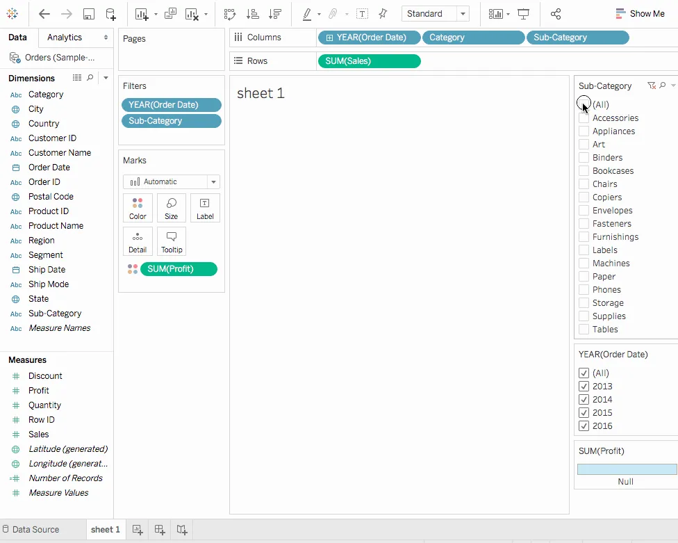

## Getting into the details

#### **Maps empower us to visualize the data broadly. In the last step, we discovered that we discovered that Tennessee, North Carolina, and Florida have a negative profit. In this section let us draw a Bar chart to explore the reason for the negative profit.**

### `Steps`

1.  Duplicate the Profit Map worksheet and name it Negative Profit Bar Chart.

2.  Click `Show Me` on the **Negative Profit Bar Chart** worksheet. `Show Me` presents the number of ways in which a graph can be plotted between items mentioned in the worksheet. From `Show Me` select the horizontal bar option and the view updates to horizontal from vertical bars instantly.

3.  We can select more than one bar at a time by simply clicking and dragging the cursor over them. We want to focus only on the three states, i.e., Tennessee, North Carolina, and Florida. Hence, we will only select the bars pertaining to them.

    **`Learn More`**

    **Creating Hierarchies**  
    Hierarchies come in handy when we want to group similar fields so that we can quickly drill down between levels in the viz.

    1.  In the Data pane, drag a field and drop it directly on top of another field or right-click the field and select
    2.  Drag any additional fields into the hierarchy. Fields can also be re-ordered in the hierarchy by simply dragging them to a new position. In the current viz. we will create the following hierarchies: Location, Order, and Product.  

        
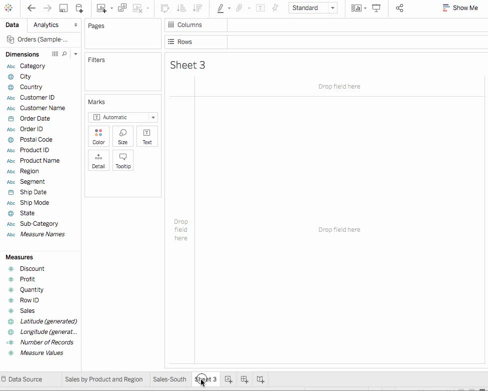

4.  On the Rows Shelf, click the plus-shaped icon on the `State` Field to drill-down to the `City` level.

    1.  That's a lot of data. We can use `N-Filter` to filter and reveal the weakest performers. For that, drag `City` from the `Data` pane to the Filters shelf. Click By field and then Click the `Top` drop-down and select `Bottom` to reveal the weakest performers. Type 5 in the text box to show the bottom 5 performers in the data set.

**We now see that Jacksonville and Miami, Florida; Burlington, North Carolina; and Knoxville and Memphis, Tennessee are the poorest performing cities by profit. There is one other mark in the view—Jacksonville, North Carolina—that doesn't belong here since it has profitable sales. This means there is an issue in the filter we applied. We will take the help of Tableau Order of Operations.**

1.  On the Filters shelf, right-click the Inclusions (Country, State) set and select `Add to Context`. We find that now **Concord**(**North Carolina**) appears in view while **Miami**(**Florida**) have disappeared. This makes sense now.

2.  But **Jacksonville** (**North Carolina**) is still present which is incorrect. On the Rows shelf, click the plus-shaped icon on `City` tab to drill down to the Postal Code level. Right-click the postal code for Jacksonville, NC, 28540, and then select `Exclude` to exclude **Jacksonville manually**.

3.  Drag Postal Code of the Rows shelf. This is the final view.  

    
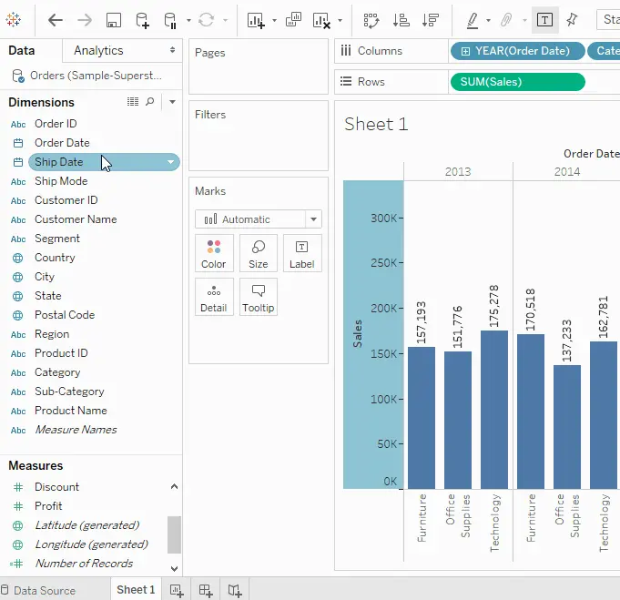

### `Hands On`

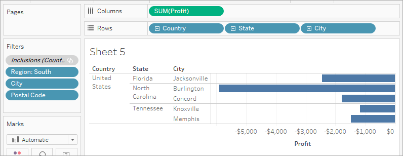

## Key Findings

#### **Let us now focus only on the loss-making entities, i.e., the Products and also let us identify the locations where such products are sold.**

### `Steps`

1.  Drag `Sub-Category` to the Rows to further drill down.
2.  Similarly, drag the `Profit` to `Color` on the Marks card. This enables us to spot products with negative profit quickly.
3.  Right-click the `Order Date` and select `Show Filter`. It seems that Machines, tables, and binders are performing poorly. So what should we do? One solution would be to stop the sale of these products in Jacksonville, Concord, Burlington, Knoxville, and Memphis? Let's verify if our decision is right.
4.  Let us head back o previously created `Profit Map` sheet tab.
5.  Now, click on the `Sub-Category` field to select the `Show Filter` option.
6.  Drag `Profit` from under `Measures` onto the `Label` Marks card.
7.  Again, click on the `Order Date` and select `Show Filter`. From the filter let us clear off the items which we think are contributing to negative profit. So, uncheck the boxes in front of Binders, Machines, and Tables respectively. Now we are only left with the profit-making entities. This shows that the entities like Binders, machines, and tables were actually causing losses in some areas and we were right in our findings.

### `Hands On`

# 5\. Dashboard

#### **A dashboard is a collection of several views, enabling one to compare a variety of data simultaneously.**

## Creating a Dashboard

### `Steps`

1.  Click the `New dashboard` button.
2.  Drag `Sales in the South` to the empty dashboard
3.  Drag `Profit Map` to the dashboard, and drop it on top of the Sales in the South view. Both views can be seen at once. To be able to present data in a manner so that others can understand it we can arrange the dashboard to our liking.
4.  On the `Sales South` worksheet in the dashboard view, click under the `Region` and clear off the `Show Header`. Repeat the same process for all the other headers. This helps to emphasize only what is needed and hides away the not so important information.
5.  On the `Profit Map`, Hide the Title as well and perform the same steps for the `Sales South` map.
6.  We can see that the `Sub-Category` filter card and `Year of Order Date` have been repeated on the right-side. Let us get rid of the extra by simply crossing them out. Finally, click on the `Year of Order Date`. A drop-down arrow appears and select the option of `Single Value (Slider)`. Now let the magic unfold. Experiment by choosing different years on the slider and the Sales also vary accordingly.
7.  Drag the `SUM(Profit)` filter to the bottom of the dashboard below Sales in South for a better view.

### `Hands On`

## Adding Interactiveness

#### In order to make the dashboard more interactive like viewing which sub-categories are profitable in which states, a few changes need to be done.

### `Steps`

1.  Let's start with the `Profit Map`. On clicking the map, a `Use as filter` icon appears in the upper right. Click on it. If we select any map, Sales corresponding to that state will be highlighted in the `Sales-South` map.
2.  For the `Year of Order Date`, click on the drop-down option and go to `Apply to Worksheets > Selected Worksheets`. A dialog box opens up. Select the `All` option followed by `OK`. What does this option do? It applies filters to all the worksheets having the same data source.
3.  Explore and experiment. In the visualization below, we can filter the `Sales South` map to view products that are being sold in North Carolina only. We can then easily explore the profits yearly.
4.  Rename the Dashboard to `Regional Sales and Profit`.

### `Hands On`

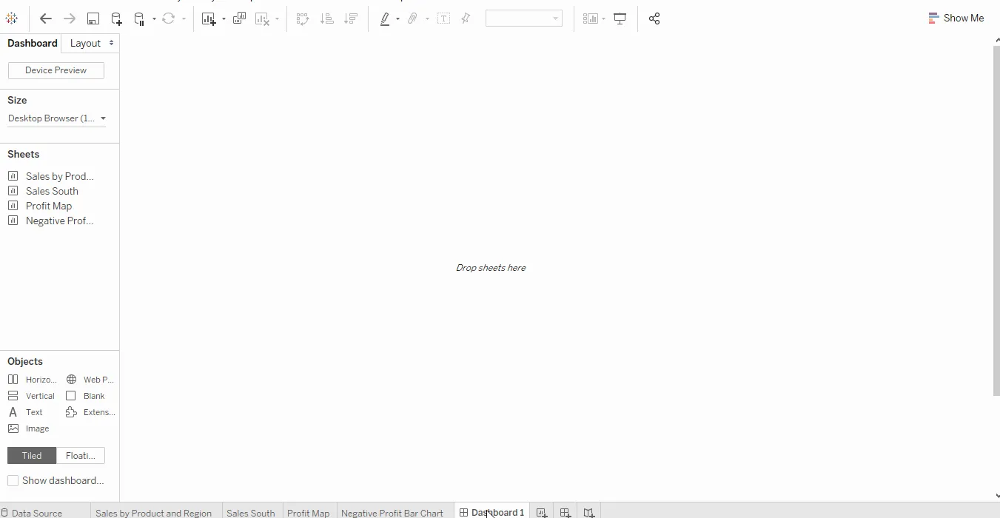

#### **Thus, selling machines in the North Carolina did not bring any profits to the company.**

# 6\. Story

#### A dashboard is a cool feature, but tableau also offers us to showcase our results in presentation mode in the form of stories about which we will discuss in this section.

## Building a Story

### `Steps`

1.  Click the `New story` button.
2.  From the Story pane on the left, drag the `Sales in the South` worksheet (created earlier) onto the view.
3.  Edit the text in the gray box above the worksheet. This is the caption. Name it as `Sales and profit by year`.
4.  Stories are quite specific. Here we will tell a story about selling machines in North Carolina. In the Story pane, click on `Duplicate` to duplicate the first caption, or you may even create a new one.
5.  In the `Sub-Category`, filter `select` only `Machines`. This helps to gauge sales and profit of machines by year.
6.  Rename the caption to `Machine sales and profit by year`.

### `Hands On`

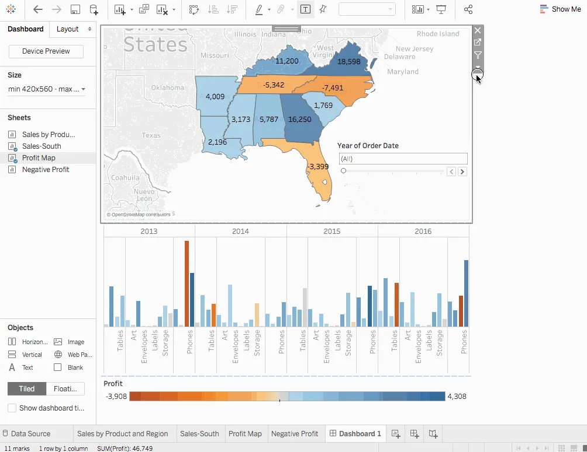

## Making a Conclusion

#### It is clear that machines in North Carolina are leading to loss of profit. However, this cannot be demonstrated by looking at Profit and Sales on the whole. For this, we need regional Profit.

### `Steps`

1.  In the Story pane, select `Blank`. Drag the already created dashboard `Regional Sales and Profit` onto the canvas.
2.  Caption it as `Low performing items in the South`.
3.  Select `Duplicate` to create another story point with the Regional Profit dashboard. Select North Carolina on the bar chart since we are interested in showing more about it.
4.  Select All the years.
5.  Add a caption for clarity, like, `Profit in NC : 2013-2016`.
6.  Select any year like 2014\. Add a caption, for example, `Profit in NC : 2014` and then click on the Duplicate tab. Repeat the same step for all the remaining years.
7.  Click on the presentation mode and let the `story` unfold.

### `Hands On`

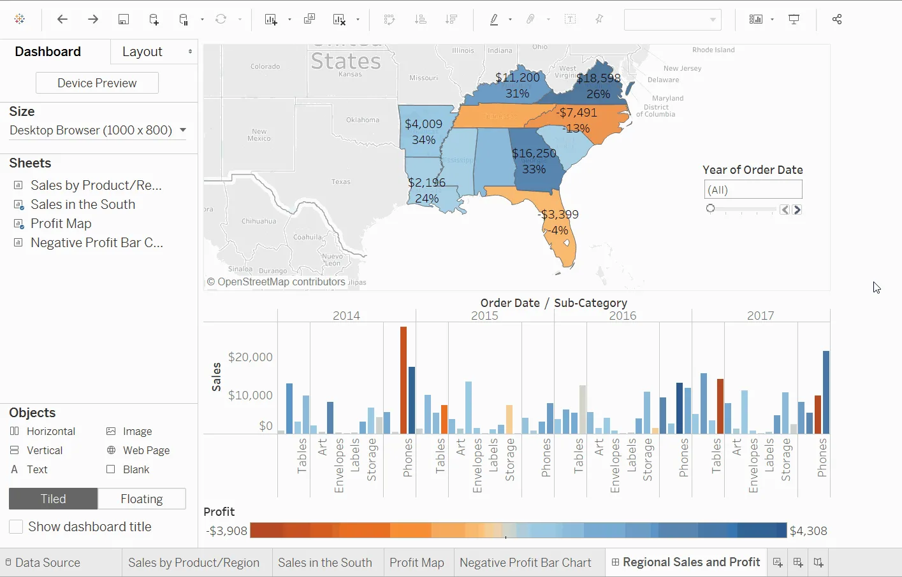

#### Now we have an idea about, what products were introduced to the North Carolina market when, and how they performed. Not only have we identified a way to address negative profit, but have also successfully managed to back it with data. This is the advantage of Story in Tableau.

# 7\. Tableau's integration with R, Python & SQL

Apart from the various visualization advantages that Tableau offers, it also has an amazing out of the box connection capabilities. Tableau can easily integrate with languages like Python and R and even with DBMS like SQL. This offers increased advantages regarding functionalities and comes in handy for Data Scientists who are used to working in Python or R. They can directly import the R and Python scripts in Tableau and take advantage of its visualizations which are far more superior than that of these languages. Also, the visualization capabilities of tableau are easy to use and very intuitive, thereby saving a lot of time for the Data Scientists.

In this section, we will see how we can connect Tableau with these external sources and the advantages of these connections.

## Tableau and R

R is a popular statistical language used to perform sophisticated predictive analytics, such as linear and nonlinear modeling, statistical tests, time-series analysis, classification, clustering, etc.[(Tableau 8.1 and R)](https://www.tableau.com/about/blog/2013/10/tableau-81-and-r-25327) Using Tableau in conjunction with R has the following advantages:

*   Leverages the statistical power of tableau by giving its users access to sophisticated R libraries for gaining better and deeper insights from the data.
*   Tableaus's enhanced data exploration options and ability to connect to multiple sources comes in handy for R users.
*   Further, it also enables Tableau users to benefit from the usefulness of R language without having to actually know the language.

### How does Tableau integrate with R?

R functions and models can be used in Tableau by creating new calculated fields that dynamically invoke the R engine and pass values to R. These results are then returned back to Tableau to be used for visualization purpose.

#### Setting up Tableau Desktop with R

*   **Download and Install `Rserve`.**

You will need to download and install `Rserve` package for Tableau to connect and utilize the R script functions. In the R console, enter the following commands:

    install.packages(“Rserve”)
    library(Rserve)
    Rserve() / Rserve(args = ‘ — no-save’)

#### Connect Tableau to the R Server

After `Rserve` is successfully installed, open Tableau Desktop and follow the below mentioned steps.

1.  Go to the `Help > Settings and Preferences and select Manage External Service Connection`.

    

2.  Enter the server name as “Localhost” (or “127.0.0.1”) and a port of “6311”.

3.  Click on the “Test Connection” button. You should see a successful message prompt. Click OK to close.

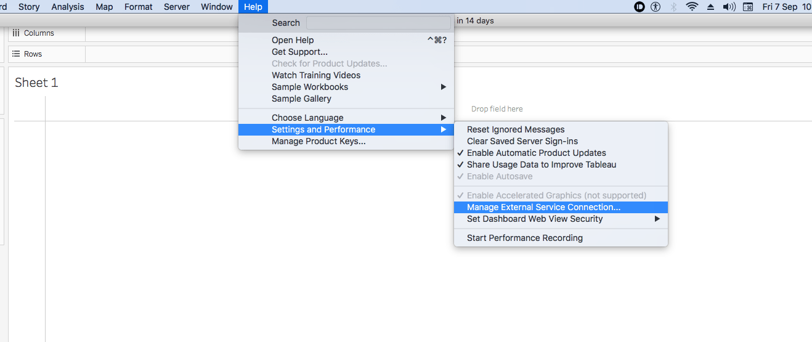

#### Start using the R scripts in Tableau

Upon successfully accomplishing the above steps, we will be able to create new calculated fields in Tableau Desktop that utilize the SCRIPT_* functions to make R functional calls.

Let’s get to work and see how we can use tableau capabilities with R.We will utilize the inbuilt Sample Superstore dataset to calculate Profit both by using R script and by Tableau ‘s drag and Drop feature. We will then compare both the results.

### `Steps`

1.  Open Tableau workbook and connect to the sample superstore data.
2.  Connect to Rserve. Once tableau desktop is connected to Rserve, it can invoke R engine through calculated fields.
3.  We will now create a calculated field called Expected Profit.

    Four functions are available for use with R, and they all begin with the word **script.** The functions are:

    *   SCRIPT_REAL: returns Real numbers as results
    *   SCRIPT_STR: returns string
    *   SCRIPT_INT : returns integers
    *   SCRIPT_BOOL: returns booleans
    *   For this example, we are going to use the SCRIPT_REAL function. We are going to create a simple `linear regression` in Tableau.
4.  Open up the calculated field and insert the following script.

        SCRIPT_REAL("fit <- lm(.arg1 ~ .arg2 +  .arg3 + .arg4)
        fit$fitted
        ",
        SUM([Profit]),  AVG([Sales]),  AVG([Quantity]),   AVG([Discount]))

    The script above pertains to the linear regression model in R. This model will have one **dependent variable(arg1)** and three **independent variables(arg2, arg3, arg4)**. These arguments are just placeholders, and when the script gets passed back to R, the arguments will be replaced with the tableau columns that they correspond too. 5\. Input the tableau fields that correspond to each of the variables. The dependent variable here is profit, so we’ll put `SUM(Profit)` first since that corresponds to argument 1\. Similarly, we will use the `average unit price, average order quantity` and `average discount` for the other three arguments respectively.

5.  These inputs will now all be pulled into the model for determining expected profit levels. We are now ready to use this calculation within Tableau visualizations. Drag category over onto the rows and then `Profit` onto columns. Now drag `Expected Profit` over onto the columns.

6.  We can now analyze the model to see how the **Expected profit calculated in R compares to the actual profits**. We can continue to analyze this further by pulling customer segments over onto the colors, and now we’ve created a stacked bar chart can also utilize ordered dates to break out the data by years or by quarters.

### `Hands On`

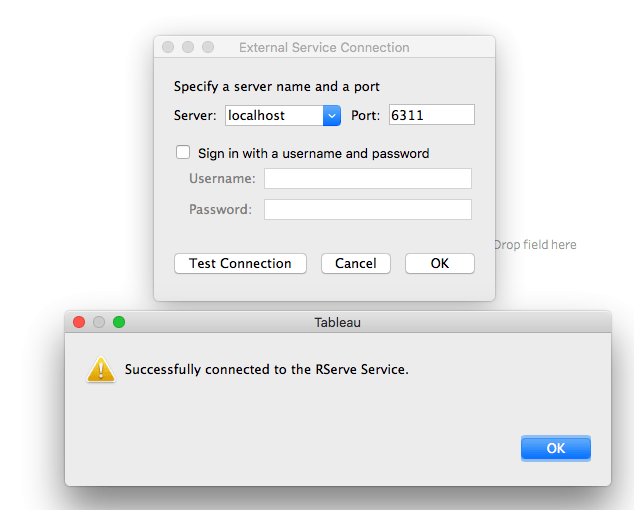

One might wonder all the above calculations could have been done in Tableau without using R. So, why should we go through the process of downloading and configuring Rserve in Tableau and write scripts? R is a potent language because of its power to forecast, utilizing widely-used libraries that contain well-known algorithms easily. Imagine how nice it would be to make predictions for our business in Tableau, by calling a simple R script and then being able to incorporate it into Tableau's visualizations.

## Tableau and Python

Python is a widely used general-purpose programming language. Python provides a large number of libraries to perform statistical analysis, predictive modeling or machine learning. Connecting Tableau with Python is one of the best approaches for predictive analytics. Tabpy is a package developed to do the same. To enable Tableau to harness the power of Python, it can be connected to the TabPy server to execute Python code on the fly and display results in the form of visualizations.

### How does Tableau integrate with Python?

When we use TabPy with Tableau, we can define calculated fields in Python, thereby leveraging the power of a large number of machine-learning libraries right from our visualizations.

#### Setting up Tableau Desktop with Python

**Download and Install `Tabpy`.**

Running a Python code within a Tableau workbook requires a Python server to execute it. The TabPy framework is what gets the job done. Download TabPy from Github at the following [link](https://github.com/tableau/TabPy/). Alternatively, you can follow the steps below:

    conda install -c anaconda tabpy-server

Then cd to the directory containing the downloaded tabpy server and run.

    python setp.py

#### Connecting Tableau with TabPy

The next step is to connect Tableau with TabPy. This can be done by going to `Help > Settings and Performance > Manage External Service Connection:`

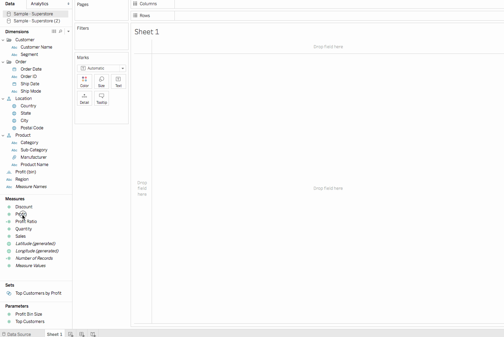

Test the connection. If all goes smoothly, you should be greeted with a “successfully connected” prompt.

#### Start using the Python scripts in Tableau

The Python integration in Tableau is a very useful feature. Take for instance the problem of Sentiment Analysis. It is a common problem in the Machine Learning community and can be accomplished by various machine learning Algorithms. However, by using a combination of tableau and Python, the same can be achieved in a few lines of Python code. The results can then be visualized in Tableau for further insights. Let us see this with an example[(Leverage the power of Python in Tableau with TabPy)](https://www.tableau.com/about/blog/2016/11/leverage-power-python-tableau-tabpy-62077)

**Sentiment Analysis with Tabpy**

We will be using the mobile reviews dataset which can be downloaded from [here](https://github.com/parulnith/Data-Visualisation-with-tableau/blob/master/Data%20Visualisation%20with%20Tableau/reviews.csv).

### `Steps:`

1.  Import the dataset into Tableau Desktop
2.  Connect to Tabpy. Once Tableau desktop is connected to `Tabpy`, it can invoke the Python engine through calculated fields.
3.  We will now create a calculated field called `Sentiment` as follows: `

        SCRIPT_REAL("from vaderSentiment.vaderSentiment import  SentimentIntensityAnalyzer  
        vs = []  
        analyzer  = SentimentIntensityAnalyzer()  
        for i in range(0,len(_arg1)):  
         a = analyzer.polarity_scores(_arg1[i])['compound']  
         vs.append(a)  
        return vs",ATTR([Reviews]))`

    We are using the `VADER sentiment analysis` tool here. It is a lexicon and rule-based sentiment analysis tool that is _specifically attuned to sentiments expressed in social media_. To use this tool, you will need to install it first. Please read more at their [github page](https://github.com/cjhutto/vaderSentiment).

4.  Now, drag `Reviews` onto rows and `Sentiment` onto **Text and Color Marks card** and see the magic happening. We get the sentiment analysis of the review done without any hassle. Also, it gets super easy to visualize the results too. The positive reviews are in increasing order of green while the negative ones are in red.

    
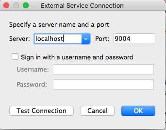

The above example clearly shows the power brought about by Tableau's integration with Python. By having the Sentiment scores at our disposal, we can work with it to dig deeper into the details. For instance, As a business owner, I can filter the negative reviews and contemplate on the reasons for the same. I can also filter on the positive reviews to get an idea about the products which makes the consumers happy.

# 8\. Saving the work

## Tableau Desktop

To save a Tableau workbook locally, Select File > Save. Specify the workbook file name in the `Save As` dialog box. Tableau by default saves the file with the .twb extension.

## Tableau Public

With Tableau Public all the views and data is made public and anybody on the internet has access to it. `Select Server > Tableau Public > Save to Tableau Public` and enter the credentials.

## [Tableau Server](https://www.tableau.com/products/server)

In case the data is confidential, and the story needs to be shared with the entire team, Tableau Server comes in handy. To publish a story to Tableau Server, Select `Select Server > Publish Workbook` or `click Share` on the toolbar. But make sure to create an account first.

* * *

That's all we need to create a good visualization in Tableau although, one might find doing a lot more revising in each stage than we did here. So with experimentation and practice, tableau becomes a lot more familiar and will unleash amazing features to help us analyze and present data. Please comment below in case of any queries or questions and Happy Visualizing.

<link href="assets/solarized-dark.css" rel="stylesheet"><link href="assets/css.css" rel="stylesheet"><link href="assets/css_002.css" rel="stylesheet">
